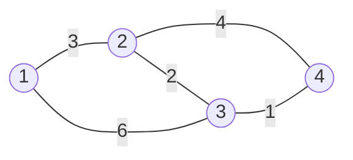

# Dijkstra's Algorithm

- It is used for solving `single-source` shortest path problems havinf `non-negative` edge weight in the graph. 
- It is used to find the **shortest distance** betweeen **two vertices** on a graph. 
- It was conceived by Dutch computer scientist `Edsger W. Dijkstra` in `1956`.

