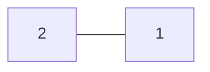
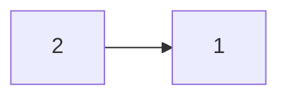
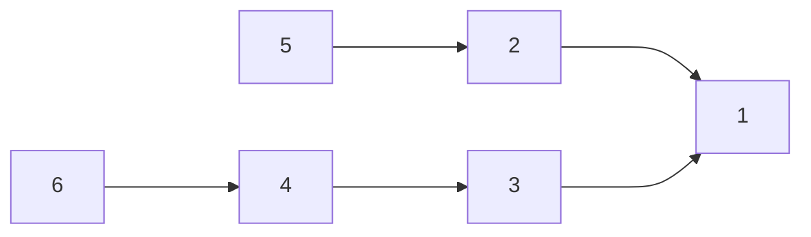
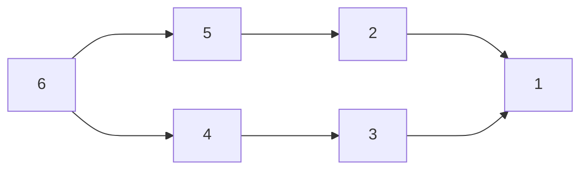

# Detecting Cycle in a Graph

- Directed Graph is sorta necessary. 
- if the graph is undirected, make it directed. 
  - it can be converted by turing the smaller element into the parent.
- during insertion of an edge between two nodes, we recursively find the parents of those two nodes and if they get another same parent, that means cycle exists.

>  Cycle Created after inserting the edge between 6 and 5 

# Minimum Spanning Tree (MST)

- Kruskal Algo
  - min heap
- Prim's Algo

## Kruskal's Algorithm

[Graph](dia.excalidraw)

## Prim's Algorithm

- any node
- all the neighbour's of that node
- minimum out of the neighbors

[Graph](dia.excalidraw)

# Belman Ford 

- It is used to detext a negative cycle in a graph

a[0]
0[a]