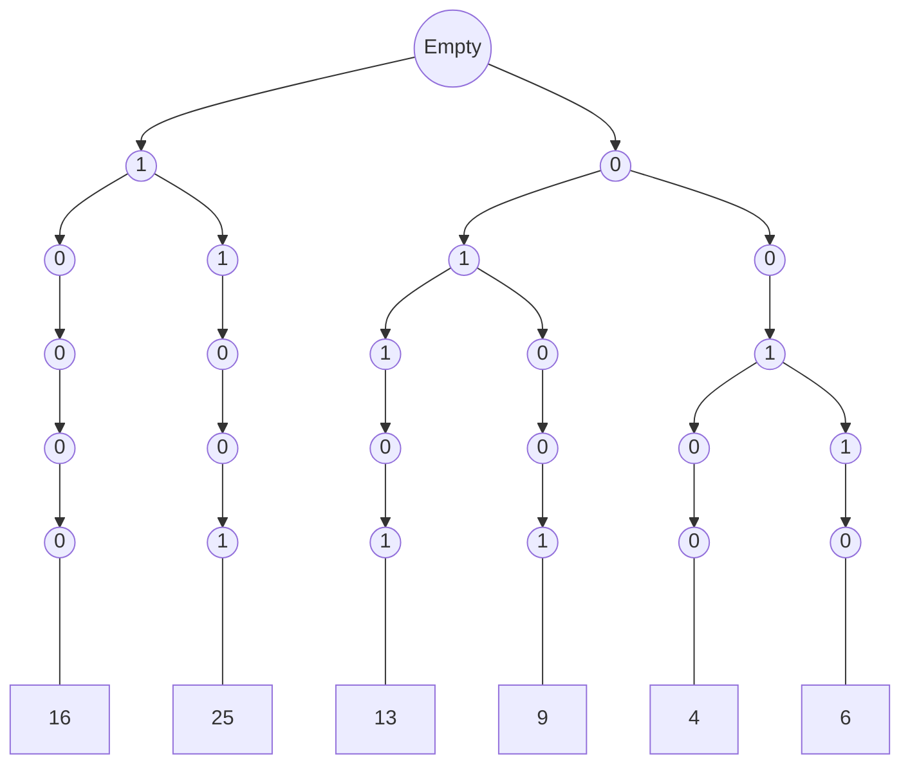

# Tries

> Q. Arr = [16, 25, 13, 9, 4, 6]\
> Find XOR of all elements(for each) in the array in such a way, so that it's value can be maximum 

- Brute Force -> O(n^2)
- Tries -> O(32 * n) => O(n) (Only for the creation of Tries) , O(1) for comparison

| decimal | binary |
| :-----: | :----: |
|   16    | 10000  |
|   25    | 11001  |
|   13    | 01101  |
|    9    | 01001  |
|    4    | 00100  |
|    6    | 00110  |

